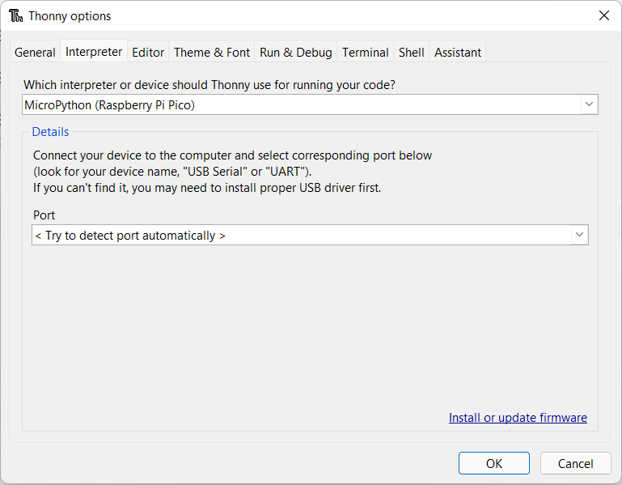

# AirQuality_UseCase_Pico

In this project, we are analysing the air quality data from raspberry pi pico.  

**Hardware_Requirements:**
<ol>
    <li>RaspberryPi Pico</li>
    <li>SCD_30 Sensor</li>
</ol>

Thonny python IDE:

Thonny python IDE is used for running the micropython code in the pico. After installation of the IDE in windows, copy paste the [code](https://github.com/Ramya-Jayaraman-CseJku/DT_API/tree/main/air_Quality/pico/sensorData.py).

Provide power supply to pico with usb and attach it to the system. So the device and port will be automatically detected in thonny python ide.

Click on Tools menu and select options. Now click on the interpreter tab and select MicroPython (Raspberry Pi Pico) interpreter and in port choose option to detect port automatically as shown in 

sensorData.py

The pin connections are set up with I2C -1 as follows:

sda= GP14

scdl=GP15

rdy=GP7

GND=Pin3

VIN=Pin40

